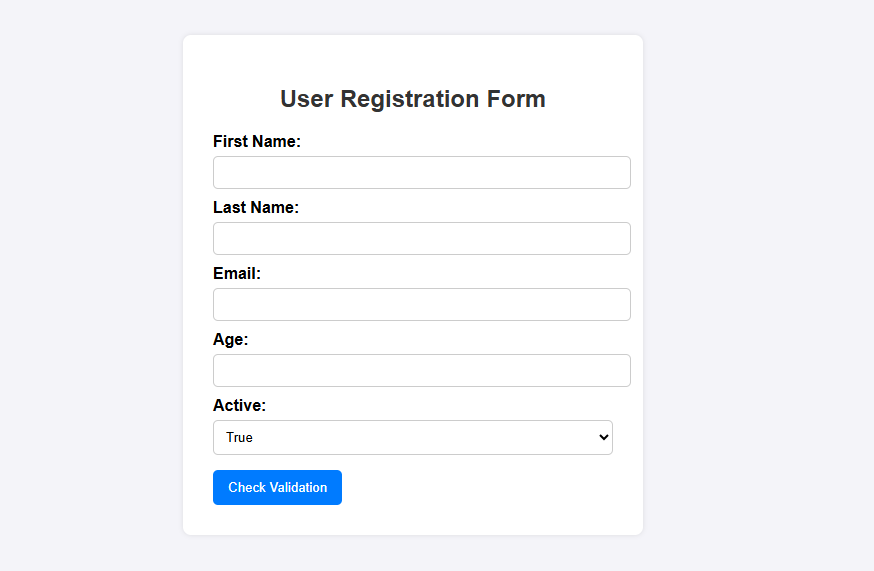

# 🧾 User Data Form Validation

A simple HTML, CSS, and JavaScript project that demonstrates how to collect and validate user data from a form.  
It checks for required fields and basic data validation (name, age, and email).

---

## 🚀 Features

- Basic **user registration form** with HTML input fields  
- Simple **client-side validation** using JavaScript  
- Checks:
  - First name is required  
  - Age must be a number and at least 13  
  - Email must contain `@`  
- Shows **success** or **error** messages on the page  
- Clean and minimal **responsive design** using only CSS

---

## 💻 Technologies Used

- **HTML5** – for structure  
- **CSS3** – for basic styling  
- **JavaScript (Vanilla)** – for validation logic

---

## 📂 Project Structure

-user-form-validation/
-index.html
-style.css
-script.js

screenshot app 

