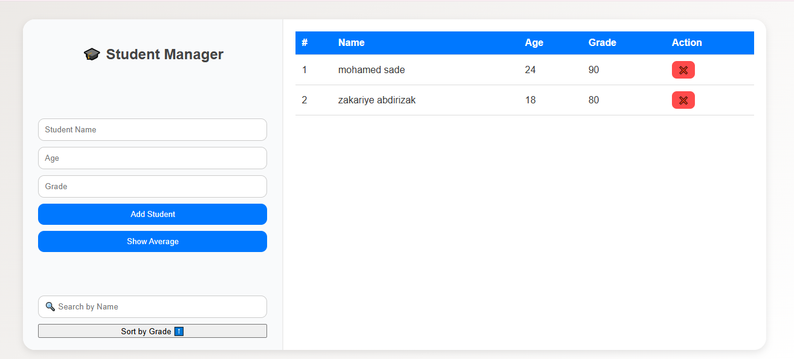

# 🎓 Student Management System

A simple **web-based student management system** built using **HTML, CSS, and JavaScript**.

---

## 🚀 Features

- ➕ Add new students (name, age, grade)
- 🧾 Display all students in a table
- ❌ Delete students
- 📊 Calculate average grade
- 🔍 Search students by name
- 🔄 Sort students by grade (ascending / descending)

---

## 🧠 Concepts Used

| Concept | Description |
|----------|--------------|
| `forEach()` | Loop through all students |
| `filter()` | Search by name |
| `sort()` | Sort by grade |
| `reduce()` | Calculate average grade |
| `splice()` | Remove a student |
| DOM Manipulation | Update table dynamically |

---

## 🏗️ Project Structure

📂 student-management/
├── index.html
├── style.css
└── script.js

