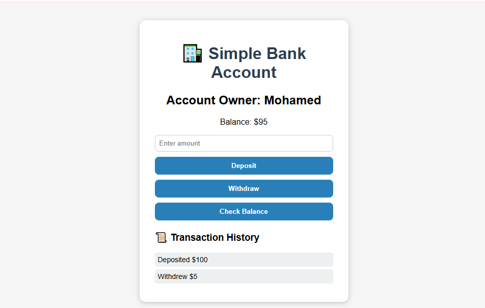

# 🏦 Simple Bank Account App

A simple JavaScript project that helps you understand **Objects, Prototypes, Constructor Functions, and the `this` keyword** in a fun, real-world example.

---

## 📘 Overview

This project simulates a mini **bank system** where a user can:
- Deposit money
- Withdraw money
- Check account balance
- View transaction history

It is built using:
- **HTML** → For the structure
- **CSS** → For simple UI design
- **JavaScript (ES6)** → For logic and interactivity

---

## 🧠 Concepts Used

| Concept | Description 
|----------|--------------|
| `Constructor Function` | Used to create multiple account objects easily |
| `Prototype` | Shared methods like `deposit()`, `withdraw()` to avoid duplication |
| `this` Keyword | Refers to the specific bank account being used |
| `DOM Manipulation` | Updating the balance and transaction history dynamically |
| `Event Listeners` | Handling user actions like clicking buttons |

---

## ⚙️ Features

✅ Create a new account object  
✅ Deposit money  
✅ Withdraw money (with validation)  
✅ Check current balance  
✅ Display transaction history  

---

## 🧩 Folder Structure

📁 Simple-Bank-Account

index.html # Structure of the app
style.css # Styling and layout
script.js # JavaScript logic (core functionality)

