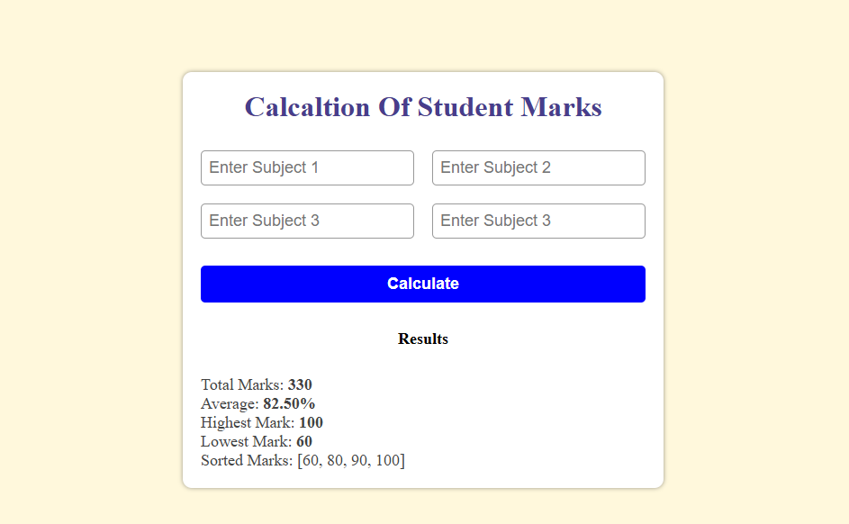

🎓 Student Marks Calculator

A simple JavaScript mini project that calculates a student's total marks, average, highest and lowest score, and sorts all marks — using arrays, loops, and DOM manipulation.

🧠 Concepts Covered

This project helps you practice:

Arrays (reduce, sort, Math.max, Math.min)

DOM manipulation (querySelector, innerHTML)

Conditionals (if, some)

Input validation

Template literals

Basic CSS layout and styling

🖥️ Demo Preview
Example Output:
Student Marks: [78, 45, 89, 67, 92]

Total Marks: 371
Average: 74.20%
Highest Mark: 92
Lowest Mark: 45
Sorted Marks: [45, 67, 78, 89, 92]

⚙️ How It Works

Enter marks for four subjects (each between 0 and 100).

Click the Calculate button.

The app will display:

✅ Total Marks

✅ Average Percentage

✅ Highest & Lowest Marks

✅ Sorted List of Marks

If you enter any invalid value (like blank, negative, or above 100), it will show a warning message.

📁 Project Structure
student-marks-calculator/
│
├── index.html     # Main structure
├── style.css      # Styling for layout
└── script.js      # JavaScript logic

💻 Technologies Used

HTML5 – for structure

CSS3 – for layout and design

JavaScript (ES6) – for logic, array operations, and validation

🚀 How to Run

Download or clone this project:

git clone https://github.com/mohamedsade43/student-marks-calculator.git

Open the index.html file in your browser.

Enter your subject marks and click Calculate.

🧩 Features

✅ Calculates total and average marks
✅ Finds highest and lowest score
✅ Sorts marks in ascending order
✅ Validates input (0–100 only)
✅ Clean, modern, and responsive UI

🎯 Learning Goal

This project helps beginners understand arrays and how to use JavaScript to manipulate data and update the DOM.
It’s a great exercise to strengthen your fundamentals before moving on to larger JS projects.

